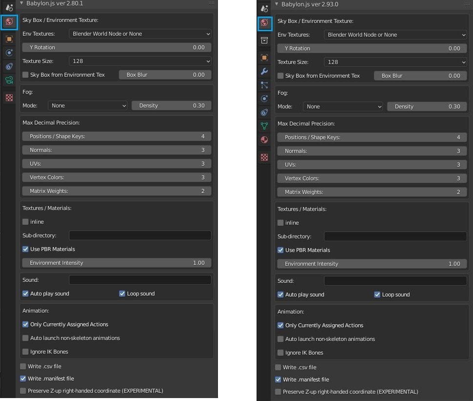
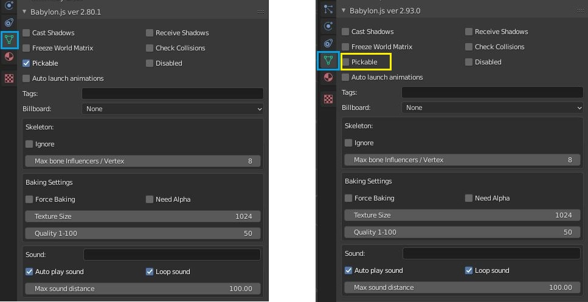
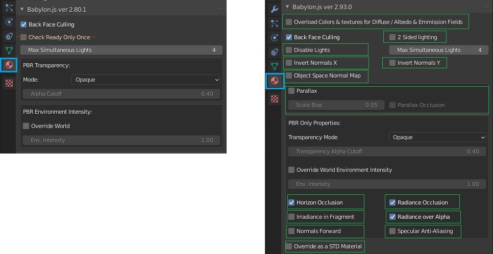
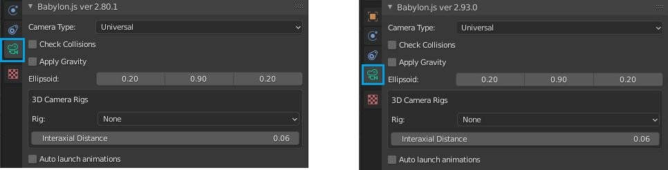
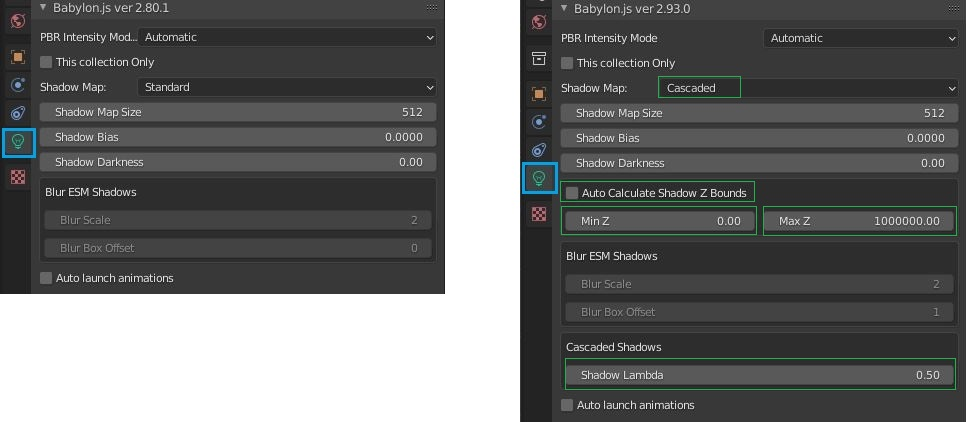

#Blender Exporter for 2.93 LTS
31 May 2022

## Non-visual Changes
* Shape Key animation added
* Most properties which are the same as the BabylonJS default excluded from file

## World
* No changes

## Mesh
* Default of pickable switched to false

## Material
* Properties added and 1 removed
* Emissive Intensity now used from Principled node

## Camera
* Removed obsolete VR Cameras from List

## Light
* added support for Cascaded Shadows & shadow Z bounds

